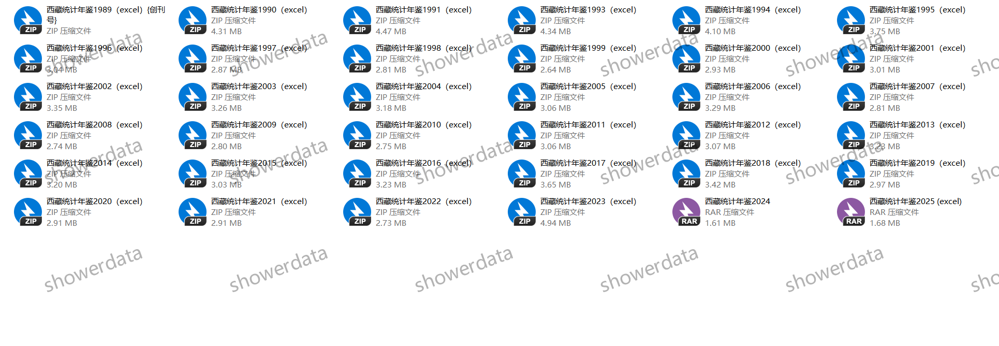
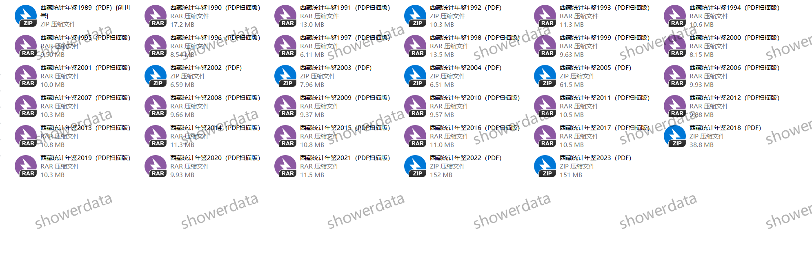
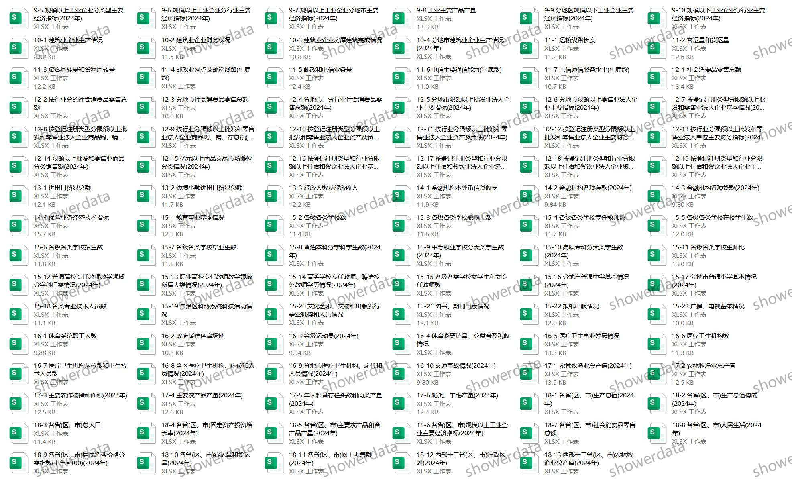
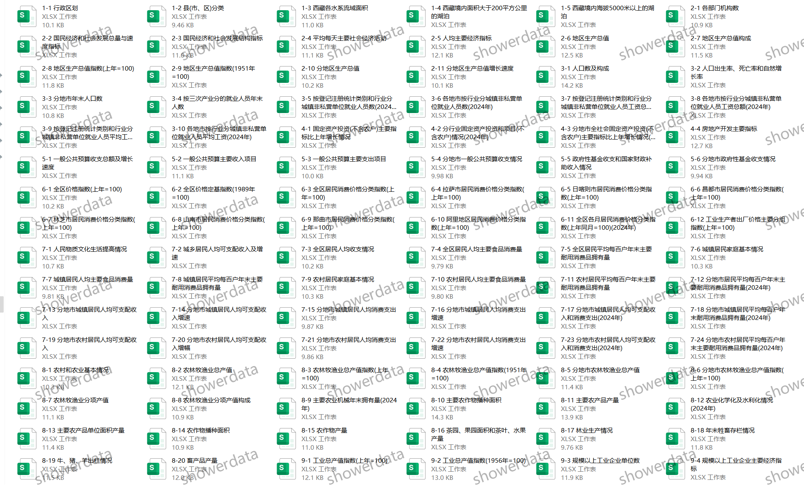

## Body

"Tibet Statistical Yearbook" (1989-2025)

Data Year: The title year is the year the data was compiled, while the data year is the year before the publication of the statistical yearbook.
Please refer to the image below for a complete display of the description. Before purchasing, make sure to read thoroughly! After shipping, there will be no returns or exchanges for any reason!

01. Data Introduction
The "Tibet Statistical Yearbook" (1989-2025)

02. Indicator Details
(1) The directory is displayed in the image, please take your time to view it and decide whether to purchase based on your needs. I cannot help you find the data if you don't ask me. All the information is here, and after shipping, we do not support unreasonable returns.
(2) The displayed directory is for the year 2025, and due to the limited space, only a part of it is shown. The statistical methods may change from one year to another. Academic common sense, the data recorded in statistical materials are the data from the previous year, which is also an academic common sense, hope everyone understands.
(3) If the material is placed in a zip file, you need to save the zip file first, then download it, and finally extract it.

## Images

Here is a pay link on Stripe ( https://buy.stripe.com/3cs8yP7sY87d0vu9AB ). Please contact me lonlonago@foxmail.com after funding $89, and I will send you a complete data files , thank you!

